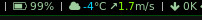

# weatheri3blocks
Minimalistic weather block for i3blocks written in python.

This is a small python script to parse some basic weather information from
[wttr.in](https://wttr.in/) and output the data in pretty colors with [fontawesome](https://pypi.org/project/fontawesome/) icons. 

# Requirements, configuration and installation
To use this script you only need python3 and
[fontawesome](https://pypi.org/project/fontawesome/). Download *w.py* and
*colortrans.py* and add a block

    [weather]
    markup=pango
    separator=true
    command=python3 ~/code/python/weatheri3blocks/w.py kiev
    interval=900
    
in your ~/.config/i3blocks/config.

Btw, the colortrans.py module is completely stolen from [MicahElliott](https://gist.github.com/MicahElliott/719710).

